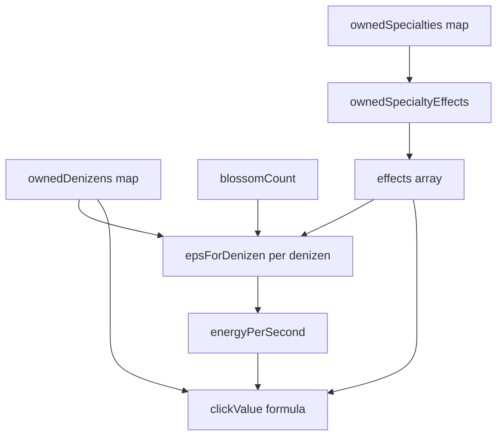

# PondClicker Redux — evolution → EpS / click simulation audit

This document maps **owned specialty (evolution) effects** to the formulas in
[`simulation.ts`](./simulation.ts). Pricing tier multipliers (`DENIZEN_EVOLUTION_TIER_MULT`)
affect **shop prices only**, not yield.

## Data flow



Purchase wiring: `Clicker2GamePage.buySpecialty` sets `ownedSpecialties[id] = true`.
The game loop and UI call `simulateGame(ownedDenizens, ownedSpecialties, …)` with
the same maps — no separate “evolution multiplier” layer.

## Per-denizen EpS (`epsForDenizen`)

For each denizen with `owned > 0`:

| Term | Source |
|------|--------|
| `baseEps` | `denizens.ts` |
| `denizenEfficiencyMultiplier(id)` | Product of `×2` for each owned `double_denizen` or `double_click_and_denizen` targeting **this** denizen |
| `globalEpsBoost()` | `1 + (Σ production_percent + Σ eps_percent_per_blossom × blossoms) / 100` |
| Pairing steps | For each `denizen_eps_percent_per_denizen` where `targetDenizenId === id`: `perCopy × (1 + percent × floor(sourceOwned / sourcePerStep) / 100)` — **multiplicative** across multiple pairing cards |
| Ripple rings add-on | If `id === ripples`: `+ concentricRingsBonusPerNonRipple × nonRippleCount × effMult` per copy (same efficiency/global boost as base EpS) |
| Mutagen | `× (1 + mutationLevel / 100)` |
| Total row | `owned × perCopy` |

**Not applied to denizen EpS:** `click_eps_percent`, `concentric_rings` (except ripple additive path above).

## Total EpS

`energyPerSecond = Σ denizenEps[id]`.

## Click value (`simulateGame`)

```
ringsBonus = concentricRingsBonusPerNonRipple × nonRippleCount
clickMult = rippleEfficiencyMultiplier × globalEpsBoost
clickEpsPercent = Σ click_eps_percent.percent

clickValue = max(0, (1 + ringsBonus) × clickMult)
           + (energyPerSecond × clickEpsPercent) / 100
```

| Effect type | EpS | Click baseline `(1+rings)×clickMult` | Click EpS-linked term |
|-------------|-----|--------------------------------------|------------------------|
| `double_denizen` (target D) | D only | Only if D is `ripples` | — |
| `double_click_and_denizen` (ripples) | ripples | yes (via `rippleEfficiencyMultiplier`) | — |
| `production_percent` | all denizens | yes (via `globalEpsBoost`) | scales indirectly when EpS-linked clicks exist |
| `eps_percent_per_blossom` | all denizens | yes (via `globalEpsBoost`) | scales indirectly |
| `denizen_eps_percent_per_denizen` | target denizen only | — | — |
| `click_eps_percent` | — | — | yes |
| `concentric_rings` | ripples additive | `ringsBonus` on `(1+…)` | — |
| `concentric_rings_mult` | ripples additive | multiplies `ringsBonus` | — |

Weather (rain/bluster/sun) is applied **outside** `simulateGame` in `Clicker2GamePage`
(`clickWeatherMultiplier`, `effectiveEnergyPerSecond`).

## Effect sources in catalog

| Chain | Typical effects | Defined in |
|-------|-----------------|------------|
| Denizen tiers (×15) | `double_denizen` or ripple `double_click_and_denizen` | `specialties.ts` `buildDoubleTier` |
| Ripple extras | `concentric_rings`, `concentric_rings_mult` | `specialties.ts` |
| Pond production | `production_percent` (+1% / +2% per tier) | `specialties.ts` `buildPondProductionChain` |
| Click reflection | `click_eps_percent` (+1% per tier) | `specialties.ts` |
| Pollinator | `eps_percent_per_blossom` | `pollinatorEvolutions.ts` |
| Pairing | `double_denizen` (L) + `denizen_eps_percent_per_denizen` (H) | `pairingEvolutions.ts` → generated |

Pairing cards use `effects[]`; `ownedSpecialtyEffects` expands both `effect` and `effects`.

## Audit findings (implementation review)

### Correctly wired

- Denizen evolution cards apply **×2 per owned card** via `double_denizen` / `double_click_and_denizen`, not via tier price multipliers.
- Pond production and pollinator bonuses share `globalEpsBoost` with click baseline multiplier (intended: production boosts clicks too).
- Click reflection adds EpS-proportional click damage without changing `energyPerSecond`.
- Pairing doubles L and step-scales H EpS; regression tests in `pairingEvolutions.test.ts` and `simulation.effects-audit.test.ts`.
- `marginalEpsIfBuySpecialty` / `marginalClickIfBuySpecialty` use the same `simulateGame` path as runtime.

### Intentional behaviors (not bugs)

- **Multiple pairing rows** targeting the same H denizen multiply pairing `%` bonuses separately.
- **Ripple pairing + ripple evolution doubles** stack: pairing adds `double_denizen` for ripples as L, ripple shop adds `double_click_and_denizen` — both multipliers apply where relevant.
- **Concentric Rings** bonus scales with **total non-ripple denizen count**, so buying denizens changes ripple EpS and click baseline even without new evolutions.

### Progression “slowdown” around ~650K EpS

Not a missing multiplier in simulation. At that band, typical causes:

- **Unlock gates** (pond production `unlockAllTimeEnergy`, denizen `unlockOwned` tiers, pairing H-count formulas) require more spend before the next evolution or denizen copy.
- **Payback targets** (~120s at reference unlock in `evolutionPricing.ts`) make later evolution prices large relative to marginal EpS.
- **Base cost / EpS curve** (recent denizen table) — early tiers have lower payback ratios until more doubles and pond % stack.

Use `marginalEpsIfBuySpecialty` / `marginalEpsIfBuyDenizen` at your save state to verify marginal gains match expectations.

## Regression tests

See [`simulation.effects-audit.test.ts`](./simulation.effects-audit.test.ts) for invariants enforced in CI.
